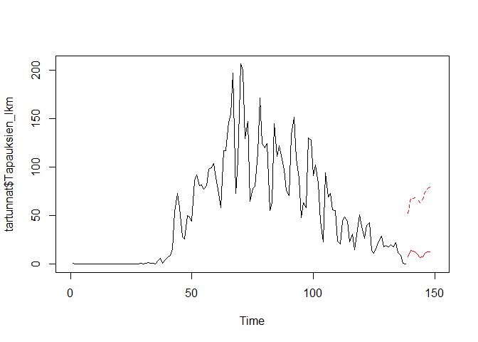

Tartuntatilastot THL:n Sampo-tietokannasta
================
Sjö, P.

Tämä koodi hakee THL:n ylläpitämästä Sampo-tietokannasta päivitetyt
tilastot Suomen koronatapauksista

### Aineiston kuvailu

Aineiston tunnusluvut sekä kuvaaja

    ##    Min. 1st Qu.  Median    Mean 3rd Qu.    Max. 
    ##    0.00    1.00   41.50   51.36   85.25  206.00

<!-- -->

Istutetun mallin tulokset

    ## 
    ## Family: gaussian 
    ## Link function: identity 
    ## 
    ## Formula:
    ## Tapauksien_lkm ~ s(nro)
    ## 
    ## Parametric coefficients:
    ##             Estimate Std. Error t value Pr(>|t|)    
    ## (Intercept)   51.355      2.018   25.45   <2e-16 ***
    ## ---
    ## Signif. codes:  0 '***' 0.001 '**' 0.01 '*' 0.05 '.' 0.1 ' ' 1
    ## 
    ## Approximate significance of smooth terms:
    ##          edf Ref.df     F p-value    
    ## s(nro) 6.599   7.73 65.83  <2e-16 ***
    ## ---
    ## Signif. codes:  0 '***' 0.001 '**' 0.01 '*' 0.05 '.' 0.1 ' ' 1
    ## 
    ## R-sq.(adj) =  0.789   Deviance explained = 79.9%
    ## GCV = 594.46  Scale est. = 561.73    n = 138

### Ennustava malli

#### Aineiston autokorrelaatio

<!-- -->

#### Autoregressiivinen malli ja sen ennustus seuraavalle 10 päivälle (95 % luottamusväli)

    ## 
    ## Call:
    ## arima(x = tartunnat$Tapauksien_lkm, order = c(6, 0, 0))
    ## 
    ## Coefficients:
    ##          ar1      ar2     ar3     ar4      ar5     ar6  intercept
    ##       0.6430  -0.1128  0.1007  0.0245  -0.0940  0.3956    28.8291
    ## s.e.  0.0772   0.0941  0.0935  0.0939   0.0931  0.0759    33.2988
    ## 
    ## sigma^2 estimated as 499.5:  log likelihood = -625.94,  aic = 1267.87

    ## $pred
    ## Time Series:
    ## Start = 139 
    ## End = 148 
    ## Frequency = 1 
    ##  [1]  7.382449 13.885554 13.263672 12.414654  9.703950  7.063497  7.879727
    ##  [8] 11.039689 12.480922 12.987681
    ## 
    ## $se
    ## Time Series:
    ## Start = 139 
    ## End = 148 
    ## Frequency = 1 
    ##  [1] 22.34886 26.56995 27.40596 27.84916 28.19742 28.22332 29.45568 31.40889
    ##  [9] 32.53375 33.20516

<!-- -->
