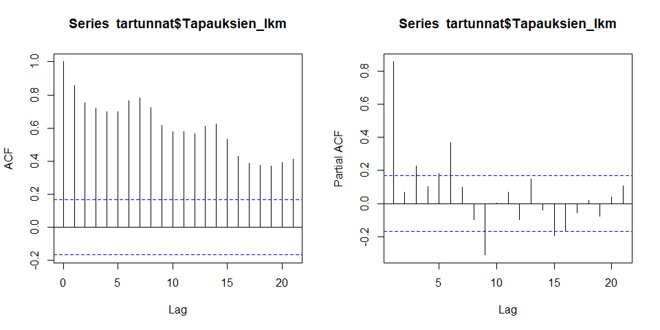
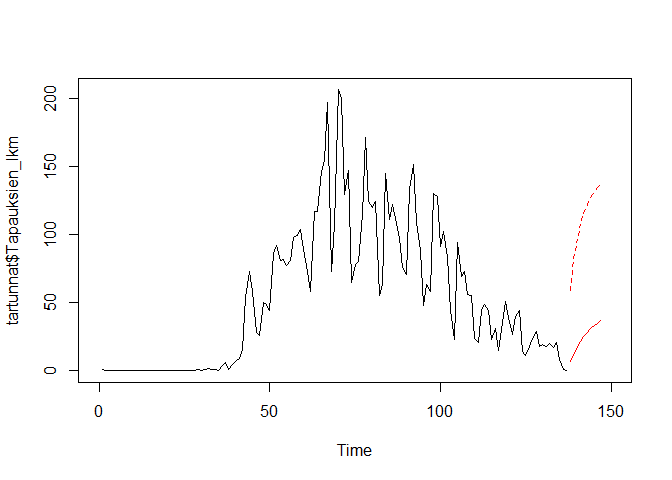

Tartuntatilastot THL:n Sampo-tietokannasta
================
Sjö, P.

Tämä koodi hakee THL:n ylläpitämästä Sampo-tietokannasta päivitetyt
tilastot Uudenmaan koronatapauksista

### Aineiston kuvailu

Aineiston tunnusluvut sekä kuvaaja

    ##    Min. 1st Qu.  Median    Mean 3rd Qu.    Max. 
    ##    0.00    1.00   44.00   51.63   86.00  206.00

<!-- -->

Istutetun mallin tulokset

    ## 
    ## Family: gaussian 
    ## Link function: identity 
    ## 
    ## Formula:
    ## Tapauksien_lkm ~ s(nro)
    ## 
    ## Parametric coefficients:
    ##             Estimate Std. Error t value Pr(>|t|)    
    ## (Intercept)   51.628      2.034   25.38   <2e-16 ***
    ## ---
    ## Signif. codes:  0 '***' 0.001 '**' 0.01 '*' 0.05 '.' 0.1 ' ' 1
    ## 
    ## Approximate significance of smooth terms:
    ##          edf Ref.df    F p-value    
    ## s(nro) 6.527  7.665 65.5  <2e-16 ***
    ## ---
    ## Signif. codes:  0 '***' 0.001 '**' 0.01 '*' 0.05 '.' 0.1 ' ' 1
    ## 
    ## R-sq.(adj) =  0.787   Deviance explained = 79.8%
    ## GCV =  599.7  Scale est. = 566.75    n = 137

### Ennustava malli

#### Aineiston autokorrelaatio

<!-- -->

#### Autoregressiivinen malli ja sen ennustus seuraavalle 10 päivälle (95 % luottamusväli)

    ## 
    ## Call:
    ## arima(x = tartunnat$Tapauksien_lkm, order = c(6, 0, 0))
    ## 
    ## Coefficients:
    ##          ar1      ar2     ar3     ar4      ar5     ar6  intercept
    ##       0.6429  -0.1135  0.1006  0.0256  -0.0943  0.3954    29.1223
    ## s.e.  0.0775   0.0944  0.0939  0.0943   0.0935  0.0762    33.3282
    ## 
    ## sigma^2 estimated as 503.7:  log likelihood = -621.99,  aic = 1259.97

    ## $pred
    ## Time Series:
    ## Start = 138 
    ## End = 147 
    ## Frequency = 1 
    ##  [1]  8.796115 11.964750 15.531688 13.845358 10.226747  7.306424  8.939889
    ##  [8] 10.830633 13.043776 14.016367
    ## 
    ## $se
    ## Time Series:
    ## Start = 138 
    ## End = 147 
    ## Frequency = 1 
    ##  [1] 22.44324 26.68131 27.51669 27.95767 28.30824 28.33462 29.57153 31.53213
    ##  [9] 32.65931 33.32854

<!-- -->
